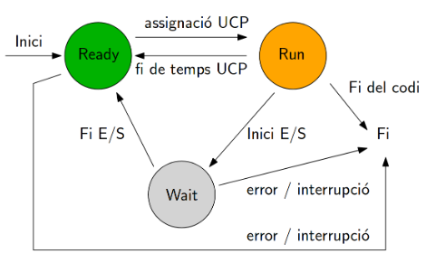

# Quins són els estats d'un procés?

Els processos poden passar per diversos estats durant el seu cicle de vida, i la gestió efectiva d'aquests estats és essencial per mantenir un sistema eficient i funcional. Aquí es presenten els principals estats dels processos:

## 5.1 Estat inici:

En aquest estat, el procés acaba de ser creat i espera ser assignat a un processador.
Les tasques associades inclouen la reserva d'espai de memòria i la inicialització de variables.

## 5.2 Estat Run:

Quan el sistema operatiu selecciona un procés per a l'execució, aquest passa a l'estat "En Execució".
En aquest moment, el procés està utilitzant la CPU per realitzar les seves tasques.

## 5.3 Estat Wait:

Un procés pot passar a aquest estat quan espera un esdeveniment extern com l'entrada de dades o l'acabament d'una operació d'entrada/sortida. En aquest estat, el procés no utilitza temps de CPU fins que es compleixi la seva condició d'espera.

## 5.4 Estat Ready:

Després de l'estat Bloquejat, un procés es mourà a l'estat Ready quan l'esdeveniment pel qual esperava ha ocorregut. En aquest estat, el procés està a punt per ser triat pel planificador de processos i ser executat.

## 5.5 Estat Finalitzat:

Un procés passa a aquest estat quan ha completat totes les seves tasques i s'ha tancat.
El sistema operatiu allibera els recursos associats a aquest procés.

## Més informació:
- [Introducció](01%CC%A3-Introduccio.md)
- [Què són els processos?](02-Que-son-els-processos.md)
- [Components dels processos](03-Components-processos.md)
- [Planificació de processos](04-Planificacio-de-processos.md)
- [FIFO](05-FIFO.md)
- [Round Robin](06-Round-Robin.md)
- [Execució de processos](08-Execucio-processos.md)

### Tornar a la pàgina principal

[Tornar](../../README.md)